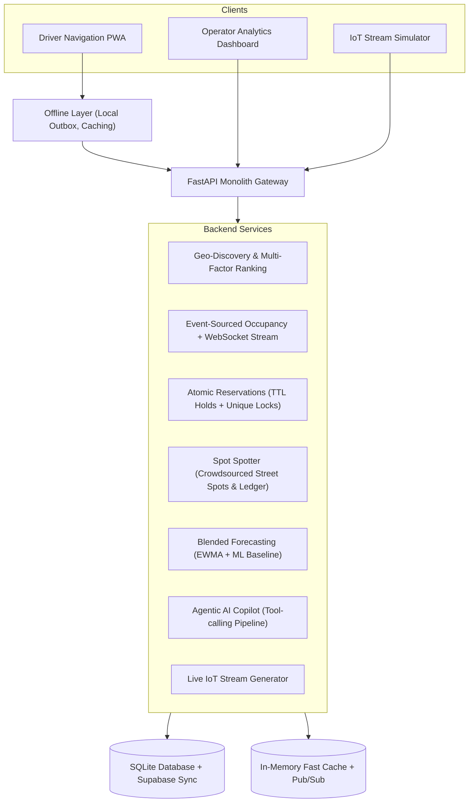

# UrbanSpot: Real-Time Parking & Space Discovery Platform

A full-stack, zero-external-dependency, offline-resilient smart parking platform seeded in **Hyderabad (Hitech City / Madhapur / Financial District)** with ₹ INR pricing.

Built following the modular monolith architecture outlined in the specification:
- **FastAPI + WebSockets Backend**: Event-sourced occupancy engine, EWMA rate projections, atomic 10-minute holds, Spot Spotter crowdsourced street spots, and tool-calling Agentic AI.
- **React + Tailwind + MapLibre GL Frontend**: Responsive driver mobile interface, operator analytics dashboard, and a toggleable live simulation drawer with Zen Linen theme support.

---

## 🏗️ Architecture & Core Features



### 1. Offline-First Driver PWA
- **Cached Reads**: Facilities and pre-computed routes persist locally.
- **Queued Writes (Outbox)**: Slot holds, confirmations, and crowdsourced reports are stored in a local outbox with client-generated idempotency UUIDs. Replays automatically upon reconnection.
- **In-App Network State Simulator**: Interactive toggle between **Online**, **Flaky (40% packet drop)**, and **Offline** modes for reliable live hackathon demonstrations.
- **Offline Entry Pass**: Every booking generates an offline PIN and QR pass for disconnected gate entry.

### 2. Spot Spotter: Crowdsourced Street Spots ("Waze for Parking")
- Drivers vacating street parking tap **Vacating Spot** with GPS accuracy checks.
- Generates ephemeral street spots with **4-minute TTL**.
- Atomic claiming prevents multiple drivers from racing for the same spot.
- Trust scoring ledger rewards honest drivers (+15 points) and penalizes false claims.

### 3. Agentic AI Parking Copilot
- Natural language query parser with tool execution:
  - `search_lots(lat, lng, max_price, features)`
  - `get_eta(start, dest)`
  - `check_forecast(lot_id, eta)`
  - `reserve_slot(lot_id, user_id)`
- **Surge-Aware Reasoning**: Live telemetry detects red/saturated facilities and automatically skips them, explaining *why* to the user.

### 4. Blended Occupancy Forecasting
- Blends real-time EWMA arrival & exit rates with historical hour-of-week ML baselines:
  $$\text{ETA}_{\text{full}} = \frac{\text{Free Slots}}{\max(\text{Arrival Rate} - \text{Exit Rate}, \epsilon)}$$
- Estimates probability of a facility being full when the driver arrives.

### 5. Live IoT Stream Simulation Control Dock
- Floating drawer accessible via quick-toggle button or `?demo=1`.
- **1-Click Scenarios**:
  - 🚗 **Evening Rush**: Surges arrivals at tech hubs (Cyber Towers, Inorbit Mall), turning markers amber and red.
  - 🏃 **Event Ends**: Mass exits that instantly recover capacity and flip forecasts.
  - 🛑 **Lot Full**: Saturates a facility to 100%, demonstrating AI dynamic rerouting.
  - 📡 **Street Wave**: Floods the map with ephemeral crowdsourced street spots.
- Speed multiplier slider from **1x to 20x** (compresses a 30-minute rush into 20 seconds).

---

## 🚀 Quick Start

To launch both backend and frontend servers simultaneously:

**Windows (PowerShell / Command Prompt):**
```powershell
.\start.bat
# or: .\start.ps1
```

**macOS / Linux:**
```bash
chmod +x ./start.sh
./start.sh
```


## 📁 Directory Structure

```
UrbanSpot/
├── start.bat                     # Windows launch script
├── start.ps1                     # PowerShell launch script
├── start.sh                      # Unix/macOS launch script
├── README.md                     # Documentation
├── backend/
│   ├── requirements.txt          # Python dependencies
│   └── app/
│       ├── main.py               # FastAPI entrypoint & WebSocket handler
│       ├── config.py             # Config & Supabase connection
│       ├── database.py           # SQLite schema, spatial math, 35 Hyderabad seeds
│       ├── cache.py              # In-memory Redis-compatible cache & pub/sub
│       ├── routers/              # API endpoints (lots, events, reservations, agent, street)
│       └── services/             # Core business logic (occupancy, forecasting, agent)
└── frontend/
    ├── package.json
    ├── vite.config.ts
    ├── tailwind.config.js
    └── src/
        ├── App.tsx               # Unified SPA & view switcher
        ├── types.ts              # TypeScript interfaces
        ├── services/             # api.ts, outbox.ts, navigation.ts
        └── components/           # MapView, DriverPhoneView, OperatorDashboardView, AgentChatModal
```

---

## 🧪 Testing Backend Endpoints

You can verify the backend services anytime via Python test suite:

```bash
cd /home/player1/Documents/3VN/backend
./venv/bin/python -c "
import asyncio, httpx
from app.main import app

async def test():
    async with httpx.AsyncClient(transport=httpx.ASGITransport(app=app), base_url='http://test') as c:
        res = await c.get('/api/lots')
        print(f'Lots loaded: {len(res.json()[\"lots\"])}')
        assert res.status_code == 200

asyncio.run(test())
"
```
